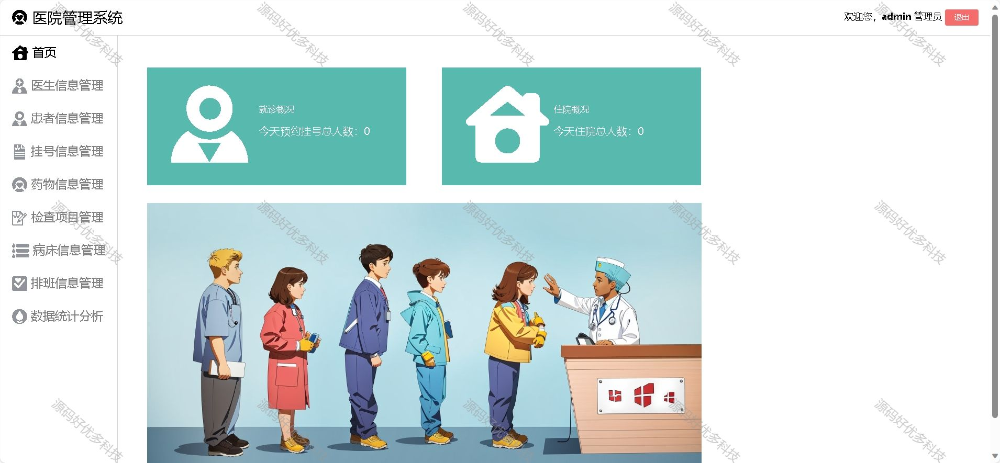
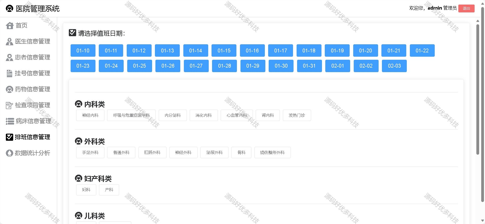
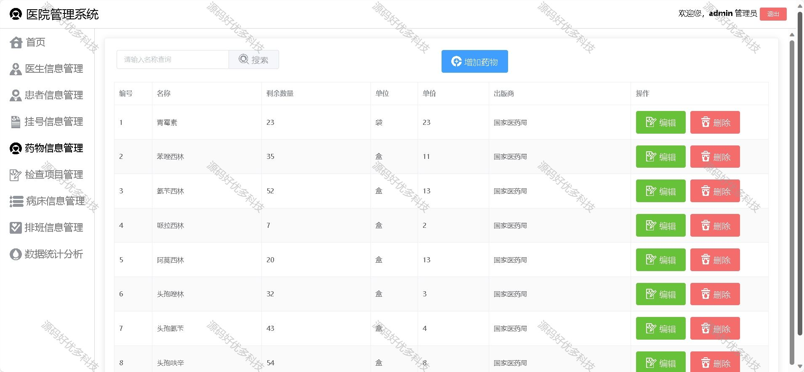
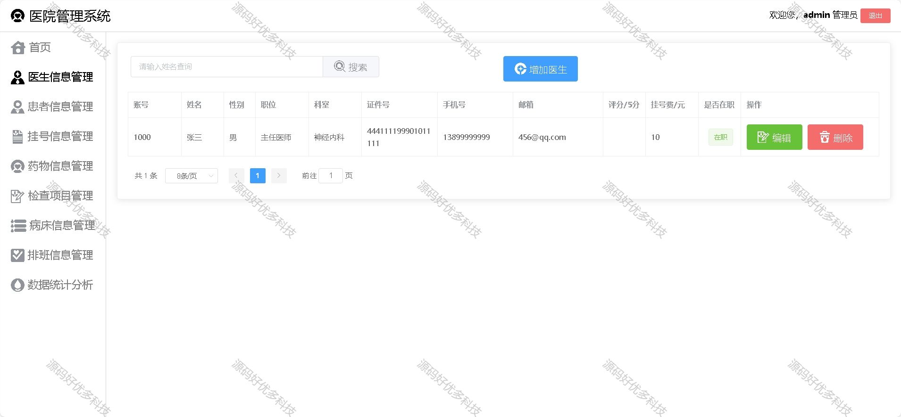
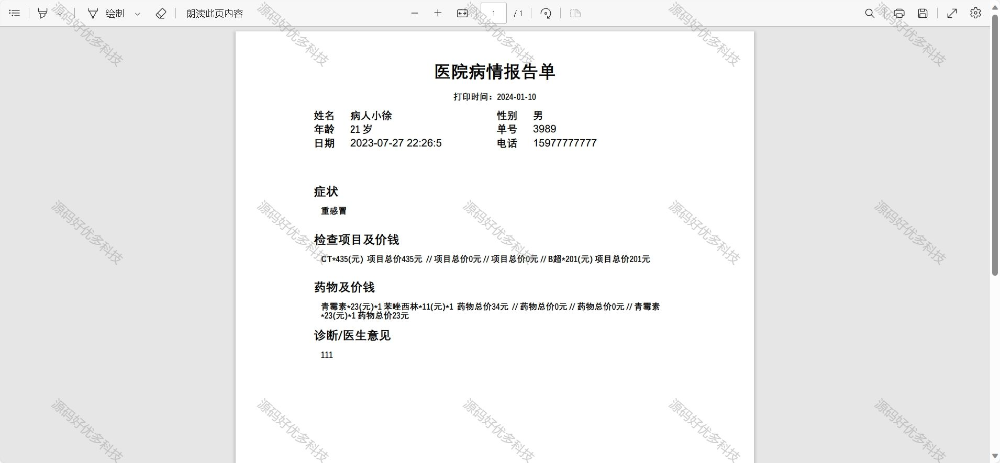
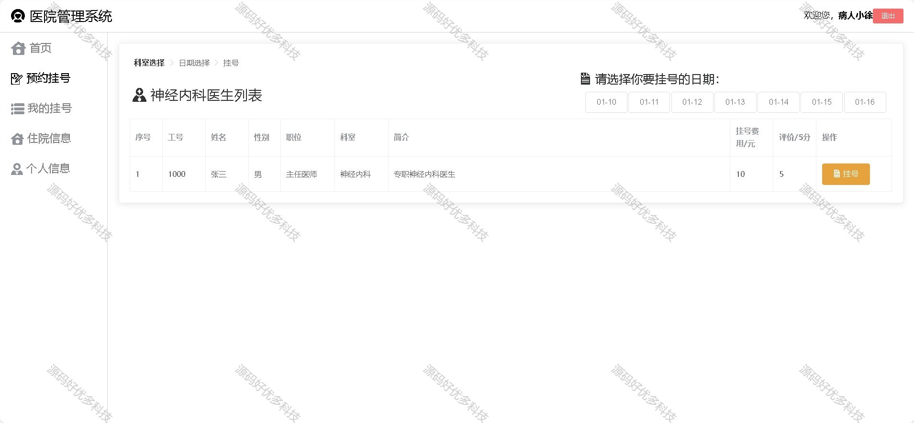
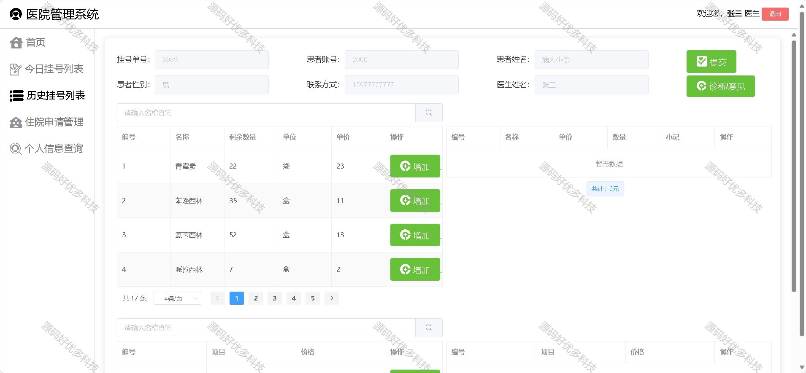
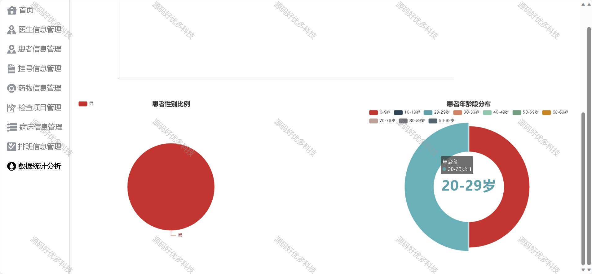

### 一、作品包含

源码+数据库+设计文档+全套环境和工具资源+部署教程

### 二、项目技术

前端技术：Html、Css、Js、Vue、Element-ui

数据库：MySQL

后端技术：Java、Spring Boot、MyBatis

### 三、运行环境

开发工具：IDEA/eclipse

数据库：MySQL8.0

数据库管理工具：Navicat10以上版本

环境配置软件： JDK1.8+Maven3.6.3

前端Nodejs：16

### 四、项目介绍

项目编号：springbootA003

随着计算机科学的迅猛发展和互联网技术的不断推进，人们的生活方式发生了巨大的变化，同时也推动了整个软件产业的发展。把传统产业服务和计算机科学结合起来，已成为一种大趋势。在传统的医院看病，病人需要办理繁杂的手续和填写众多资料，这种操作极其不友好。在一些情况下，医生需要手写病历，不清楚病人的病史，治疗效果可能不佳。随着医院改革的不断深入，一套可以提升医院工作效率、减少医疗差错、给患者提供便捷服务的软件急需出现

1. 管理员：首页展示当天的预约挂号人数和住院人数，可对医生信息进行查增，可对患者、挂号信息进行查删，可对药物、检查项目和病床信息进行增删改查，可对医生进行排班操作，可查看数据统计页面。
2. 医生：首页展示当天本人的预约挂号人数，可对患者进行诊断、开处方药、开检查项目以及追诊操作，可帮患者申请入院，可查看本人诊断的挂号信息。
3. 患者：可预约挂号，可查看本人挂号信息，可查看本人住院信息，可对医生进行评价

### 五、运行截图

